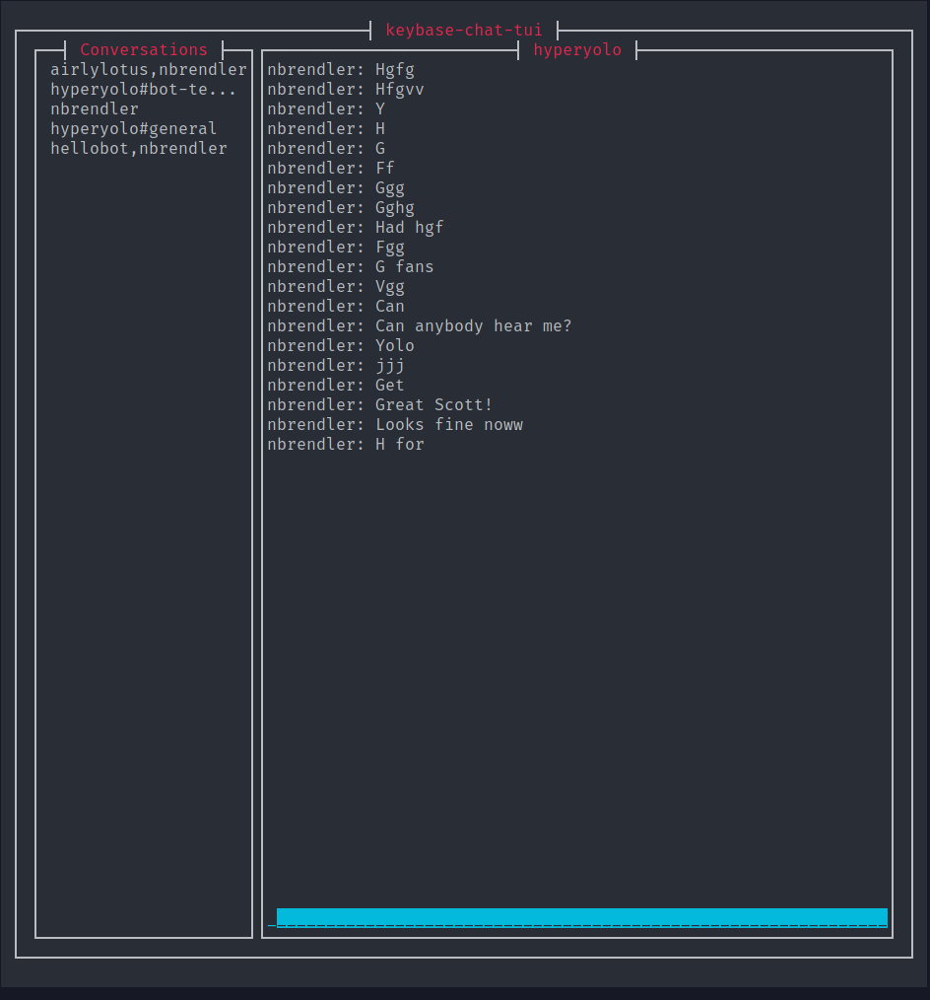

# Keybase Chat Terminal UI



This is a terminal UI app for interacting with keybase chat. Requires you have
keybase installed (e.g., `keybase chat api -h` should work). Not tested on
Windows or Mac.

This was a Rust learning project but also something I use every day!

```
# Run the UI like this
keybase-chat-ui-bin 2>/dev/null
```

To run with debug logging. Logs to stderr because stdout is for the UI.
```
RUST_BACKTRACE=1 RUST_LOG=keybase_chat_tui cargo run 2>out.log

# In another shell
tail -f out.log
```

## To Do

* Support attachments and other message types
* Release build without the env logger so you don't have to redirect stderr
* Highlight names and links in the chat
* Group team channels in the conversation list
* Refactor code out of ui.rs into more view structs modules
